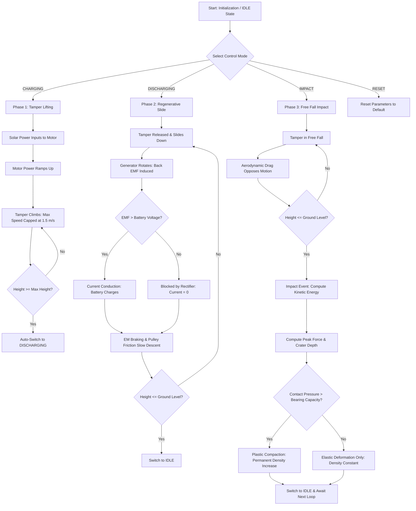
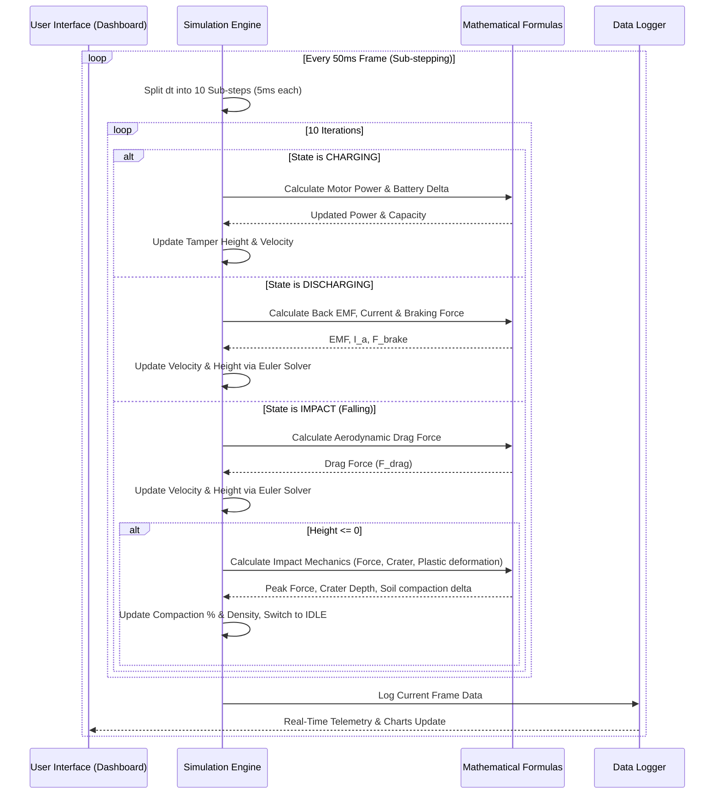
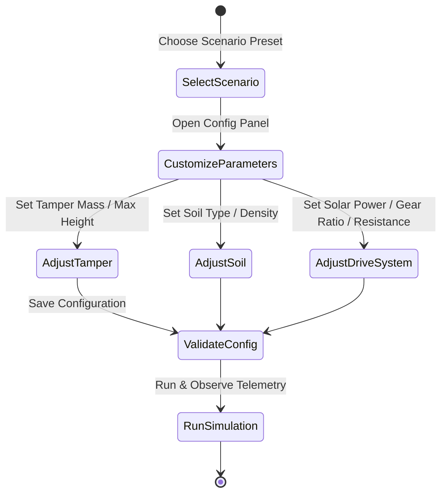

# ADC Simulation Operational Workflow

This document details the system-by-system workflows inside the Artificial Dynamic Compaction (ADC) Simulation system.

---

## 1. High-Level Operational Workflow

Below is the state transition and physical simulation loop flowchart representing how the console operates.

---

## 2. Simulation Loop Sequence Workflow

The simulation engine runs at 20Hz ($50\text{ ms}$ intervals). To ensure numerical stability for stiff differential equations, a sub-stepping execution model is used:

---

## 3. Sub-System Details

### 3.1 Solar-Motor Lifting Sub-System
1.  **Solar Input Detection:** Reads solar configuration limits ($P_{solar}$).
2.  **Motor Engagement:** Power is ramped up incrementally ($P_{motor} = P_{motor} + 180\text{ W/s} \times dt_{sub}$).
3.  **Lifting Velocity Solver:**
    $$v_{lift} = \min\left(1.5, \frac{P_{motor}}{m \cdot g}\right)$$
4.  **Position Integration:** Updates height ($h_{next} = h + v_{lift} \cdot dt_{sub}$).
5.  **State Transition:** When $h \ge h_{max}$ ($15\text{ m}$), the system triggers an automatic switch to `DISCHARGING`.

### 3.2 Regenerative Generator Sub-System
1.  **Gravity Release:** Tamper falls under gravity, generating velocity $v$.
2.  **Back EMF Generation:** The spinning pulley generates EMF ($E_g = 0.15 \cdot G \cdot |v|$).
3.  **Rectification Block:** Current flows only if Back EMF exceeds the battery voltage:
    $$I_a = \max\left(0, \frac{E_g - V_{batt}}{R_{load} + R_{\text{gen\_int}}}\right)$$
4.  **Braking Torque Feedback:** The armature current induces electromagnetic braking:
    $$F_{brake} = 0.15 \cdot G \cdot I_a$$
5.  **Euler Numerical Integration:** Accurately solves the equation of motion:
    $$a = g - \frac{F_{brake} + F_{drag} + F_{friction}}{m}$$
    $$v_{next} = v + a \cdot dt_{sub}$$
    $$h_{next} = h + v \cdot dt_{sub}$$

### 3.3 Dynamic Impact Compaction Sub-System
1.  **Free Fall:** Tamper is dropped from height $h$ in free fall, subject only to gravity and aerodynamic drag.
2.  **Kinetic Energy Capture:** At $h \le 0$, the impact velocity is used to calculate the kinetic energy:
    $$E_k = \frac{1}{2} m v^2$$
3.  **Soil Reaction Solver:** Computes soil stiffness ($k_s$) based on current soil compaction percentage:
    $$k_s = k_0 \cdot \left(1 + 3 \cdot \left(\frac{C_{soil}}{100}\right)^2\right)$$
4.  **Crater and Force Calculation:**
    $$d_{crater} = \sqrt{\frac{2 \cdot E_k}{k_s}}$$
    $$F_{peak} = k_s \cdot d_{crater}$$
    $$P_{contact} = \frac{F_{peak}}{A_{base}}$$
5.  **Compaction Evaluation:**
    *   If $P_{contact} > q_u$ (Soil Ultimate Bearing Capacity): Plastic deformation occurs. Soil compaction percentage is permanently increased:
        $$\Delta C_{soil} = \min\left(15,\ \left(\frac{P_{contact}}{q_u} - 1.0\right) \cdot 1.5 \cdot \left(1.0 - \frac{C_{soil}}{100}\right) + 0.5\right)$$
    *   If $P_{contact} \le q_u$: Elastic deformation only. Soil compaction percentage remains unchanged.
6.  **Soil Density Update:**
    $$\rho_{soil} = \rho_{initial} + \frac{C_{soil}}{100} \cdot (\rho_{max} - \rho_{initial})$$

### 3.4 Battery & Thermal Sub-System
1.  **State of Charge (SoC):** Integrates current $I_{batt}$ over time to update battery capacity.
2.  **Terminal Voltage Drop:**
    $$V_{terminal} = V_{oc} + I_{batt} \cdot R_{\text{batt\_int}}$$
3.  **Joule Heating Calculation:**
    $$P_{heat} = I_{batt}^2 \cdot R_{\text{batt\_int}}$$
4.  **Convective Cooling Dissipation:**
    $$P_{cool} = 1.5\text{ W/K} \cdot (T_{batt} - 25^\circ\text{C})$$
5.  **Thermal Solver:**
    $$\frac{dT_{batt}}{dt} = \frac{P_{heat} - P_{cool}}{1200\text{ J/K}}$$
    $$T_{\text{batt\_next}} = T_{batt} + \frac{dT_{batt}}{dt} \cdot dt_{sub}$$
6.  **Safety Alert:** Triggers warning if $T_{batt} > 45^\circ\text{C}$.

---

## 4. Configuration Tuning Workflow

To customize and test the simulation parameters, utilize the following workflow:

